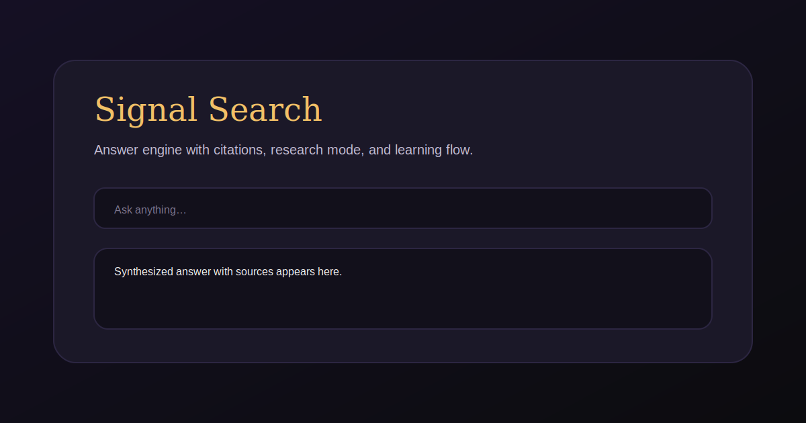

# Signal Search

A free-tier answer engine with real-time web research, citations, and learning-friendly explanations.



## Quickstart
```bash
npm install && npm run dev
```

## Features
- Web-grounded answers with citations
- Quick, Research, and Learn modes with research progress states
- Source toggle (web or offline)
- Streaming responses (NDJSON)
- Thread library with search, filters, and share links
- Research report view with export + print
- Bulk thread actions (delete, assign to space)
- Thread renaming + compact library view
- Export answers to Markdown, DOCX, and PDF
- Favorites, pinned threads, and collections
- Collection filter pills + thread notes
- Collections dashboard + tag filters
- Bulk tag assignment + tag-based sorting
- Saved search presets + collection export to Markdown
- Pinned saved searches + export filtered library
- Archive threads + recent filters history
- Recent filter pinning + header archive actions
- Archive filtered view + bump thread
- Unarchive filtered + duplicate thread
- Duplicate threads into spaces + bulk duplicate
- Bulk duplicate + bulk move/remove from space
- Move to active space + remove from all spaces
- Space stats + set active space from thread
- Edit spaces + export space to Markdown
- Duplicate space + archive/restore spaces
- Merge spaces + space tags
- Space filter in Library + Spaces dashboard
- Space tag editing in dashboard + clear filters button
- Space tag filters + export all spaces
- Space tag search + export filtered spaces
- Space dashboard thread preview
- Space dashboard sorting (name/activity)
- Unified search (threads + spaces)
- Unified search filters + export results
- Unified search recent queries + CSV export
- Unified search top results summary + clear recent
- Unified search now includes collections and files
- Unified search now includes tasks
- Unified search sort controls (relevance/newest/oldest) + per-section result limits
- Spaces with custom instructions (local-only)
- Local file attachments for context (text formats)
- File library with lightweight full-text search
- Tasks scheduler (local-only) with once/daily/weekday/weekly/monthly/yearly cadences
- Pluggable provider interface (OpenAI now, OSS models next)

## Configuration
Copy `.env.example` to `.env` and set `OPENAI_API_KEY` to enable live search.

## Notes
- Vibe coding + LLM workflow notes live in `docs/vibe-coding.md`.
- Product direction and prioritized feature plan live in `PRODUCT_GOALS.md`.

## Deploy
This is a standard Next.js app. Deploy on your platform of choice and supply the same env vars.
